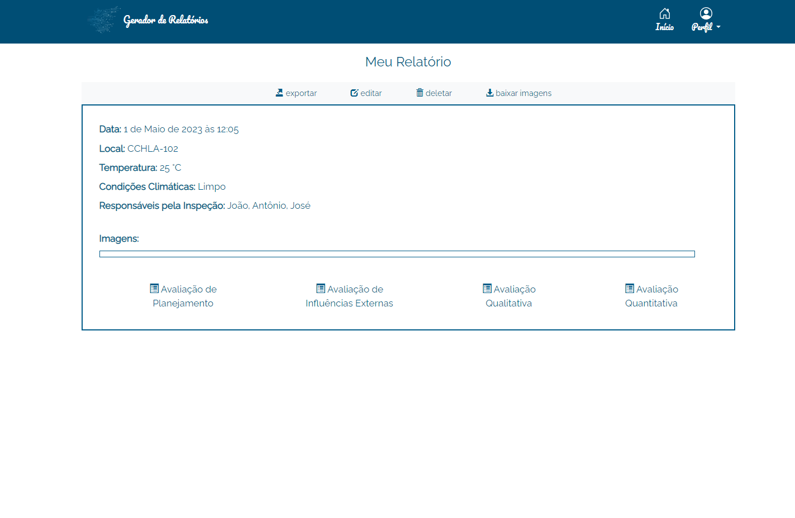

# Gerador de Relatórios

Este projeto é uma aplicação Web automatizadora do processo de geração laudos de engenheiros eletricistas.

| 🪧Vitrine.Dev |                                                   |
| ------------- | ------------------------------------------------- |
| ✨ Nome       | **Gerador de Relatórios**                         |
| 🏷 Tecnologias | javascript, html, css, python, django, postgresql |
| 🚀 URL        | https://gerador-de-relatorios.herokuapp.com/      |
| 🔥 Desafio    | https://gerador-de-relatorios.herokuapp.com/      |

<!-- Inserir imagem com a #vitrinedev ao final do link -->

## Detalhes do projeto

Este projeto foi um desafio que fiz com o intuito de aprender como desenvolver uma aplicação web completa utilizando a framework Django.
